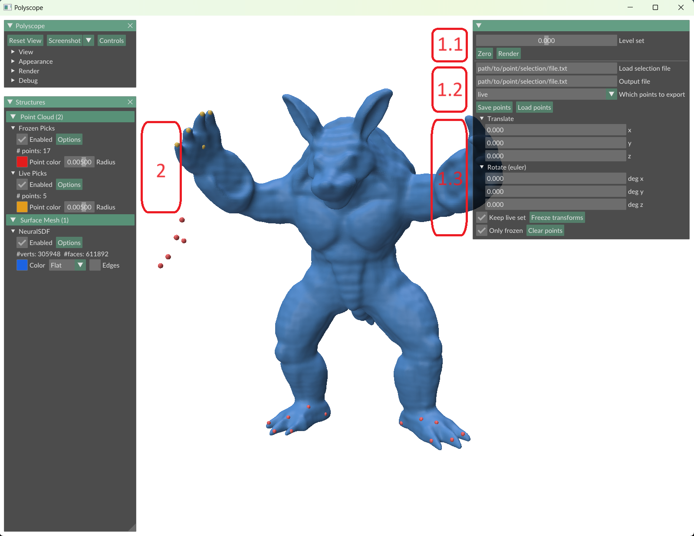

# Implicit ARAP Deformations


## Setup

Our assets (meshes, neural net weights) are available at [this link](https://drive.google.com/drive/folders/1IeyV6yHG3dKm9IPMt7zIZxWql7DV9Vlw?usp=sharing). Please download the folder and extract it into the `assets/` directory.

First, replicate and activate our conda environment using the provided env file.

```
conda env create --file env.yml
conda activate sdfedit
```

Then, feel free to set wandb in offline mode since it's only useful for debugging purposes.

## Usage


The codebase exposes three core commands: `train-sdf`, `deform-sdf` and `render-sdf`. These are invoked by running 

```
python run.py <command_name>
```

Command line options for all three are defined by the entrypoint objects instantiated in [iarap/config/defaults.py](iarap/config/defaults.py). Each attribute can be overridden by CLI, and nested configs can be accessed via dots, e.g.: 

```
python run.py train-sdf --optimizer.lr <value>
```

### Training Neural SDFs from meshes

Given a triangle mesh in any trimesh-loadable format (obj, ply, off, ...), you may run:

```
python run.py train-sdf --data.file <path/to/mesh/file>
```

This will run a standard Neural SDF fitting procedure using a Softplus-activated MLP with positional encoding. It should take around 2 minutes and 1.5GB of VRAM on a RTX4070Ti. The run will be logged in the `wandb/` folder, where you will also find the trained network weights, specifically in `wandb/<run_name>/files/checkpoints/neural_sdf.pt`. Some network weights trained with this procedure are provided in `assets/weights/`.

### Polyscope viewer with Point Picking



Our Polyscope-based viewer is useful for defining deformation handles and inspecting results. The `--load_shape` option specifies a Neural SDF weights file. The network will be used to extract level set meshes via marching cubes, which will then be displayed on the live viewer. 

Options in (1.1) allow to select which level set to visualize (push the "Render" after selecting the level set value).

By CTRL/Cmd + clicking on the displayed surface, the user can select points, which are added to the "Live Picks" point cloud (see (2)). Using the interactive commands in (1.3), the user can:

* Transform the live picks via translations and rotations about the origin
* Add the transformed live picks to the "Frozen Picks" point cloud (see (2)) once they are satisfied with the transformation. Optionally, the user may choose to clone the current (untransformed) live picks to define more transformations for the same set of points
* Delete all selected points, or only the frozen set
* Save either of the point sets, choosing which point set to save and where to save it via the options in (1.2)
* Load a previously saved point selection to the live set, specified by the option in (1.2) 

Once the deformation procedure has been run (see next section), the user may visualize the resulting surface by specifiying the deformation network weights via the `--load_deformation` option.

### As Rigid As Possible Deformation of Implicit Surfaces

The two most relevant options to the `deform-sdf` procedure are `--pretrained_shape` and `--handles_spec`. The former simply specifies the weights for the input Neural SDF to deform. The latter points to a .yaml file such as the following:

```yaml
handles:
  static:
    positions:
      - left_foot
      - right_foot
  moving:
    positions:
      - right_hand
    transform:
      - right_hand_front
```

You may find such files in `assets/constraints/<shape>/<experiment>.yaml`. They are used to specify point selection files as handles for the deformation algorithm.

* `handles.{static,moving}.positions` should be lists of file names (without extensions) in `assets/constraints/<shape>/parts`
* `handles.moving.transform` should be a list of file names (without extensions) in `assets/constraints/<shape>/transforms`. This list should conform to the following:
    * Have same length as `handles.moving.positions`
    * Every point selection file in this list should contain the same number of points to the corresponding (same index) point selection file in `handles.moving.positions`

